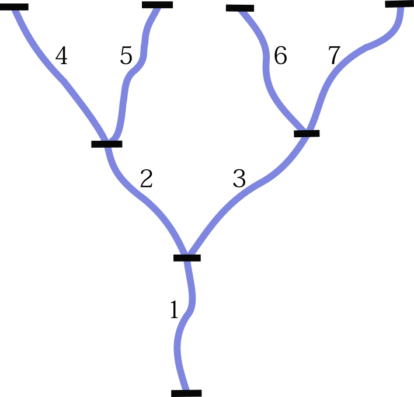

```{r setup, include=FALSE}
knitr::opts_chunk$set(collapse = TRUE)
```

# Data wrangling (munging)
Basic overview of data wrangling in R. [Data wrangling is the process of transforming and mapping data from one "raw" data form into another format with the intent of making it more appropriate and valuable for a variety of downstream purposes such as analytics.][1]


Assumed basic knowledge of R, RStudio installed and R >= 4.0.0. 


Pre-wrangling inspection functions

* base
  * `str()`
  * `unique()`
  * `table()`
  
Wrangling functions

* [dplyr][3]
  * `select()`
  * `filter()`
  * `slice()`
  * `mutate()`
  * `summarise()`
  * `count()`
  * `arrange()`
  * `*_join()`

Data reshaping functions 

* [tidyr][3]
  * `pivot_longer()`
  * `pivot_wider()`

We'll go through each of the functions with minimal examples then use a few together for a case study. 


# Set up 
We will be using the `dplyr` and `tidyr` packages for wrangling and `nzffdr` and `ggplot2`
for example data and plotting. 

Install the packages we will use:
```{r eval = FALSE}
pkgs <- c("dplyr", "tidyr", "ggplot2", "nzffdr")
for (i in pkgs) {
  if (!require(i, character.only = TRUE)) install.packages(i)
}
```

Load packages:
```{r, message = FALSE, warning = FALSE}
library(nzffdr)  # for case study data 
library(dplyr)   # for data wrangling 
library(tidyr)   # for pivot_longer()
library(ggplot2) # for figures
```

We'll also use the built in `iris` dataset to minimally explore the functions. 


# 1 Base functions for inspecting data
Prior to wrangling it is useful to inspect the data to make sure all is as it should be.  

```{r, message = FALSE}
head(iris, n = 5)

str(iris)

unique(iris$Species)

table(iris$Species)
```

# 2 Subsetting columns
Often we import more data than we need, it can be useful to drop data. 

## 2.1. Selecting/dropping columns - `dplyr::select()`

individual columns
```{r, message = FALSE}
iris %>%
  select(Petal.Width, Species) %>%
  head(n = 3)
```

multiple columns
```{r, message = FALSE}
iris %>%
  select(Sepal.Length:Petal.Length, Species)%>%
  head(n = 3)
```

prefix character matching 
```{r, message = FALSE}
iris %>%
  select(starts_with("S")) %>%
  head(n = 3)
```

multiple character patterns
```{r, message = FALSE}
iris %>% 
  select(starts_with(c("Petal", "Sepal"))) %>%
  head(n = 3)
```

character patterns anywhere in the column name
```{r, message = FALSE}
iris %>% 
  select(contains("al")) %>%
  head(n = 3)
```

drop columns
```{r, message = FALSE}
iris %>%
  select(-Petal.Width, -Species) %>%
  head(n = 3)

iris %>%
  select(!starts_with("S")) %>%
  head(n = 3)
```

## 2.2. Renaming columns

all
```{r, message = FALSE}
iris %>%
  rename_with(toupper) %>%
  head(n = 3)
```

by name
```{r, message = FALSE}
iris %>%
  rename(petal_length = Petal.Length) %>%
  head(n = 3)
```

only certain columns 
```{r, message = FALSE}
iris %>%
  rename_with(toupper, starts_with("Petal")) %>%
  head(n = 3)
```

# 3 Subsetting rows
Here we drop/keep rows based on our criteria. 

## 3.1. Filtering - `dplyr::filter()`

by name
```{r, message = FALSE}
iris %>%
  filter(Species == "setosa") %>%
  head(n = 3)
```

by value
```{r, message = FALSE}
iris %>%
  filter(Sepal.Length > 5.0) %>%
  head(n = 3)
```

multiple values
```{r, message = FALSE}
kp <- c(4.6, 5.4, 4.3, 5.8)

iris %>%
  filter(Sepal.Length %in% kp) %>%
  head()
```

using functions
```{r, message = FALSE}
iris %>% 
  filter(Sepal.Length  > mean(Sepal.Length, na.rm = TRUE)) %>%
  head(n = 3)
```

by multiple conditions
```{r, message = FALSE}
iris %>%
  filter(Species == "setosa" & Sepal.Length > 5.0) %>%
  head(n = 3)

iris %>%
  filter(Species == "setosa" | Sepal.Length > 5.0) %>%
  head(n = 3)
```

between values
```{r, message = FALSE}
iris %>%
  filter(between(Sepal.Length, 4, 5)) %>%
  head(n = 3)
```

reverse filter
```{r, message = FALSE}
iris %>%
  filter(!between(Sepal.Length, 4, 5)) %>%
  head(n = 3)
```

## 3.2 Slicing observations - `dplyr::slice()`

keep the first n rows
```{r, message = FALSE}
iris %>%
  group_by(Species) %>%
  slice(1:3) 
```

first n min/max rows 
```{r, message = FALSE}
iris %>%
  group_by(Species) %>%
  slice_min(Petal.Width, n = 5) 
```

## 3.3 Removing `NA`s

if there are `NA`s in a selected variable drop rows
```{r, message = FALSE}
iris %>%
  filter(!is.na(Sepal.Length)) %>%
  head(n = 3)
```

if there are `NA`s in any column drop row
```{r, message = FALSE}
iris %>%
  na.omit() %>%
  head(n = 3)
```


# 4 Create new variables 

## 4.1. `dplyr::mutate()`

create new columns
```{r, message = FALSE}
iris %>%
  mutate(Petal.size = Petal.Length + Petal.Width) %>%
  head(n = 3)
```

modify an existing column
```{r, message = FALSE}
iris %>%
  mutate(Species= as.character(Species)) %>%
  head(n = 3)
```

multiple columns at once 
```{r, message = FALSE}
iris %>%
  mutate(across(!Species, ~. + 100)) %>%
  head(n = 3)
```


combine with `ifelse()`
```{r, message = FALSE}
iris %>%
  mutate(Size.Class = ifelse(Sepal.Length < 5, "small", "large")) %>% 
  head(n = 5)
```

mutate and drop unused columns (Sepal.Length, Sepal.Width, Species)
```{r, message = FALSE}
iris %>%
  mutate(Petal.size = Petal.Length + Petal.Width, .keep = "used") %>%
  head(n = 3)
```

mutate and drop used columns (Petal.Length, Petal.Width)
```{r, message = FALSE}
iris %>%
  mutate(Petal.size = Petal.Length + Petal.Width, .keep = "unused") %>%
  head(n = 3)
```


# 5 Summary statistics
Either for the whole dataset or by a grouping variable e.g. for each species

## 5.1 Summarise - `dplyr::summarise()`

```{r, message = FALSE}
iris %>%
  summarise(N = n(),
         Mn.Sep.Len = mean(Sepal.Length))
```


```{r, message = FALSE}
iris %>%
  group_by(Species) %>%
  summarise(N = n(),
            Mn = median(Sepal.Length),
            Q95 = quantile(Sepal.Length, 0.95),
            Q5 = quantile(Sepal.Length, 0.05))
```


## 5.2 Counting observations - `dplyr::count()`
```{r, message = FALSE}
iris %>%
  count(Sepal.Length, name = "n_obs", sort = TRUE) %>%
  head(n = 5)
```

by sub groups 
```{r, message = FALSE}
iris %>%
  count(Species, Sepal.Length, name = "n_obs", sort = TRUE) %>%
  head(n = 5)
```


## 5.3 Arranging output - `dplyr::arrange()`

ascending 
```{r, message = FALSE}
iris %>%
  arrange(Sepal.Length) %>%
  head(n = 5)

```

descending
```{r, message = FALSE}
iris %>%
  arrange(desc(Sepal.Length)) %>%
  head(n = 5)
```

# 6 Joining datasets together
A common challenge is joining multiple datasets together e.g. water quality and biological dat for a range of sites, joining datasets can be achieved via the *_join() functions from `dplyr`.

Here are two simple datasets with a common variable `name`:
```{r, message = FALSE}
band_members
band_instruments
```

We can join the two datasets together based on `name`: 
```{r, message = FALSE}
# includes all rows that occur in both datasets
band_members %>% inner_join(band_instruments)

# includes all rows that occur in band_members
band_members %>% left_join(band_instruments)

# includes all rows that occur in band_instruments
band_members %>% right_join(band_instruments)

# includes all rows that occur in either dataset
band_members %>% full_join(band_instruments)
```


# 7 Reshaping data 
Generally data is collected in wide format, where each column is a unique variable of interest and each row is a "site" (in the general sense), for analysis it is often useful to have the data in long format, where each measured datapoint gets its own row.  

```{r reshape, echo=FALSE, fig.cap="Data reshaping", fig.align='center'}
knitr::include_graphics("reshape.png")
```

Wide to long
```{r}
iris %>%
  pivot_longer(cols = -Species, names_to = "flower_part", values_to = "size")
```

Those are most of the standard data wrangling functions commonly used on a day to day basis.


# Case study 

To show how we might use these functions in the "real world" we will work through a scenario where we analyse some freshwater fish data, we will:

1) determine how far inland the 5 species of whitebait are found in New Zealand. 

To achieve this we will need two datasets:

1) presence data for the 5 whitebait species across NZ
2) a measure of how far inland each observation is

Fish data is available from the [NZFFD][2] and the distance inland of all river reaches in NZ is available from the River Environment Classification (REC) database. 


# Part 1: Getting the data

NZFFD data is available via the nzffdr package, we'll import a subset of the entire database, getting all records from 2000 to 2010
```{r, eval = FALSE}
# Import, clean and add missing data from the NZFFD
fishD <- nzffdr::nzffd_import(starts = 2000, ends = 2010)
fishD <- nzffd_clean(fishD)
fishD <- nzffd_fill(fishD, alt = F, maps = F)
```

Subset of the REC database (the whole dataset is massive so I have put a small chunk of it on my dropbox for us to use):
```{r, eval = FALSE}
rec <- read.csv("https://www.dropbox.com/s/zqn9f9ctb4hv74q/rec2010.csv?dl=1")
```

```{r, echo = FALSE}
# load data behind the scenes so I don't have to query NZFFD while building the tutorial
fishD <- readRDS("nzffdData.rds")
rec <- read.csv("rec2010.csv")
```

# Part 2: Inspecting the data
The first thing to do when data is loaded is to inspect it to make sure everything imported as expected and variables are in the right format.


First 3 rows 
```{r}
head(fishD, n = 3)
head(rec, n = 3)
```


```{r network, echo=FALSE, fig.cap="REC river network", out.width = '30%', fig.align='center'}

```

Data structure
```{r}
str(fishD)
str(rec)
```

## Check individual variables
We downloaded data for 2000 - 2010, check that is what we actually got:

Check all the unique values of the year variable
```{r}
sort(unique(fishD$y))
table(fishD$y)
```

Have a look at the species we have 
```{r}
sort(unique(fishD$common_name))
```

Look at the REC distance to sea variable
```{r}
min(rec$DISTSEA)
max(rec$DISTSEA)

min(rec$DISTSEA, na.rm = T)
max(rec$DISTSEA, na.rm = T)
```

```{r, echo = FALSE}
options(max.print = 100)
```

check if the `nzrech` variable matches in the two datasets 
```{r}
intersect(fishD$nzreach, rec$nzreach)

setdiff(fishD$nzreach, rec$nzreach)

setdiff(rec$nzreach, fishD$nzreach)
```


# Part 3 Wrangling

Steps to take:

1) join the `dat` and `rec` datasets (`inner_join()`)
2) filter out unwanted years and species (`filter()`)
3) drop unwanted columns (`select()`)
4) create a new column distsea_km (`mutate()`)


join the two datasets 
```{r}
datBoth <- inner_join(fishD, rec, by = "nzreach")
head(datBoth, n = 3)
```

# filter rows, select columns and mutate columns
```{r, eval = FALSE}
datBoth <- datBoth %>%
  filter(y < 2011)

datBoth <- datBoth %>%
  select(nzreach, y, east, north, altitude, effort, number:common_name, 
         threat_class:native, ORDER, DISTSEA)

datBoth <- datBoth %>%
  mutate(dists_km = DISTSEA/1000)
```

```{r}
datBoth <- datBoth %>%
  filter(y < 2011) %>%
  select(nzreach, y, east, north, altitude, effort, number:common_name, 
  threat_class:native, ORDER, DISTSEA) %>%
  mutate(distsea_km = DISTSEA/1000,
         ORDER = as.factor(ORDER))
head(datBoth, n = 3)
```

filter only the whitebait species 
```{r}
wtbt <- c("Koaro", "Inanga", "Shortjaw kokopu", "Banded kokopu", "Giant kokopu")

datWtbt <- datBoth %>%
  filter(common_name %in% wtbt)
  
```


convert `common_name` variable to factor and set the order
```{r}
datWtbt$common_name <- factor(datWtbt$common_name, 
                              levels = c("Koaro", "Shortjaw kokopu", "Inanga", 
                                         "Banded kokopu", "Giant kokopu"))
```

plot
```{r}
ggplot(datWtbt, aes(x = common_name, y = distsea_km, colour = common_name)) +
  geom_jitter(alpha = 0.5) +
  scale_colour_brewer(palette = "Dark2") +
  coord_flip() +
  xlab("Species") +
  ylab("Distance to sea (km)") +
  theme_bw() +
  theme(legend.position = "bottom")
```


[1]: https://en.wikipedia.org/wiki/Data_wrangling
[2]: https://nzffdms.niwa.co.nz/search
[3]: https://dplyr.tidyverse.org